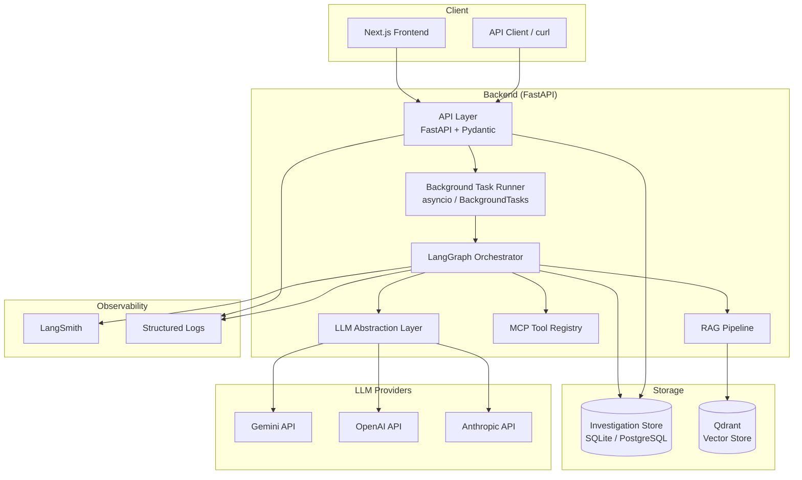
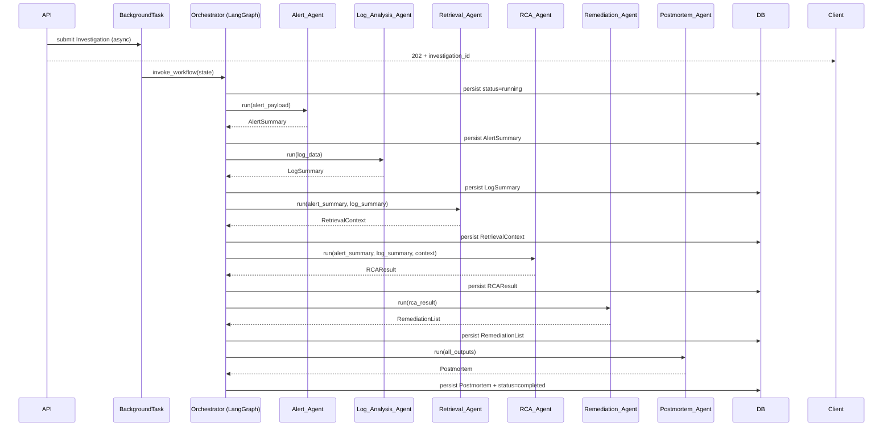
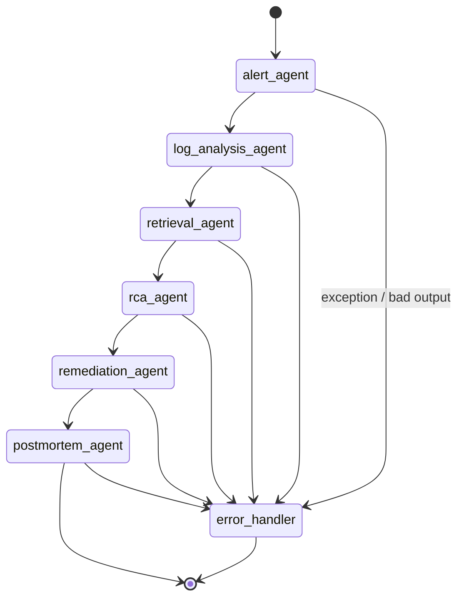
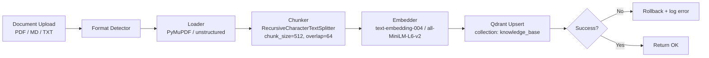

# Design Document — AI Incident Response Commander

## Overview

The AI Incident Response Commander is a production-grade agentic platform that autonomously investigates software production incidents. An SRE submits an incident (alert data, logs, metadata) via a REST API or web UI; a LangGraph-orchestrated six-agent pipeline then triages the alert, analyses logs, retrieves relevant knowledge via RAG, performs root cause analysis, generates remediation recommendations, and produces a structured postmortem report.

### Key Design Goals

- **Decoupled async execution** — HTTP responses return immediately; agent workflows run in background tasks.
- **Durable intermediate state** — every agent output is persisted before the next agent begins so partial results survive failures.
- **Modular LLM layer** — provider switching (Gemini / OpenAI / Anthropic) via a single environment variable, with no provider-specific code in agent logic.
- **Observability first** — structured JSON logging, LangSmith tracing, and per-investigation RAGAS metrics baked in from the start.
- **Testable by design** — pure agent logic separated from I/O so property-based tests can run without live LLM or vector DB calls.

---

## Architecture

### System Context Diagram



### Agent Pipeline Flow



### Component Overview

| Layer | Component | Technology |
|---|---|---|
| API | HTTP endpoints | FastAPI, Pydantic v2 |
| Orchestration | Agent workflow | LangGraph (StateGraph) |
| Agents | Six specialised agents | LangChain + Gemini/OpenAI/Anthropic |
| LLM Abstraction | Provider routing | Custom `LLMProvider` factory |
| RAG | Ingestion + retrieval | LangChain, Qdrant, `sentence-transformers` |
| MCP | Tool integrations | MCP Python SDK (stdio transport) |
| Storage | Investigation records | SQLAlchemy async + SQLite (dev) / PostgreSQL (prod) |
| Vector Store | Embedding index | Qdrant |
| Evaluation | RAG quality metrics | RAGAS |
| Observability | Traces + logs | LangSmith, Python `structlog` |
| Frontend | Web UI | Next.js 14, TypeScript, Tailwind CSS, shadcn/ui |
| Deployment | Container stack | Docker, Docker Compose |

---

## Components and Interfaces

### 2.1 FastAPI Application (`backend/app/`)

```
backend/
├── app/
│   ├── main.py                    # FastAPI app factory, lifespan handlers
│   ├── api/
│   │   ├── routes/
│   │   │   ├── incidents.py       # POST /incident, GET /incident/{id}
│   │   │   ├── reports.py         # GET /report/{id}
│   │   │   └── recommendations.py # GET /recommendations/{id}
│   │   └── middleware.py          # request_id injection, error handler
│   ├── core/
│   │   ├── config.py              # Settings (pydantic-settings)
│   │   ├── database.py            # SQLAlchemy async session factory
│   │   └── errors.py              # structured error response helpers
│   ├── models/                    # SQLAlchemy ORM models
│   ├── schemas/                   # Pydantic request/response schemas
│   ├── agents/                    # One module per agent
│   ├── orchestrator/
│   │   ├── graph.py               # LangGraph StateGraph definition
│   │   └── state.py               # InvestigationState TypedDict
│   ├── rag/
│   │   ├── ingestion.py           # Document loading, chunking, embedding
│   │   └── retrieval.py           # Query, reranking, context formatting
│   ├── llm/
│   │   └── provider.py            # LLMProvider factory + retry wrapper
│   └── mcp/
│       └── registry.py            # MCP client wrappers + timeout/cap enforcement
```

### 2.2 LangGraph Orchestrator

The orchestrator is a `StateGraph[InvestigationState]` where each node is an agent function. Edges are linear in the happy path with a shared error-handling branch.



Each node:
1. Receives the full `InvestigationState`.
2. Calls its agent logic.
3. Validates output against the agent's Pydantic output schema.
4. Persists the output to the investigation store.
5. Returns an updated state slice.

On any unhandled exception or schema validation failure the `error_handler` node persists the failure details and marks the investigation `failed`.

### 2.3 Agent Interfaces

Each agent implements a common interface:

```python
class AgentBase(ABC):
    @abstractmethod
    async def run(self, state: InvestigationState) -> dict[str, Any]:
        """Execute agent logic; return partial state update."""

    @abstractmethod
    def output_schema(self) -> type[BaseModel]:
        """Return Pydantic model for output validation."""
```

#### Alert_Agent

- Input: `state.alert_payload` (raw dict)
- Output: `AlertSummary` (alert type, severity, impacted services ≤20, timestamp, classification status)
- Timeout: 10 s (asyncio timeout)
- Fallback on malformed input: emits `classification_status=parse_error`, severity=`low`

#### Log_Analysis_Agent

- Input: `state.log_data` (raw string)
- Output: `LogSummary` (anomalies dict, error groups dict, failure patterns dict, analysis_status)
- Format support: plain text, JSON, newline-delimited streams
- Anomaly threshold: >3 occurrences of the same error type
- Failure pattern threshold: ≥3 occurrences of the same signature
- Fallback: emits `analysis_status=insufficient_data` for empty/unrecognised logs

#### Retrieval_Agent

- Input: `state.alert_summary`, `state.log_summary`
- Output: `RetrievalContext` (ranked excerpts ≤500 words each with source metadata, retrieval_status)
- Default K=5, configurable 1–20
- Similarity threshold: default 0.5
- Fallback: `retrieval_status=no_relevant_context` when no doc exceeds threshold

#### RCA_Agent

- Input: `state.alert_summary`, `state.log_summary`, `state.retrieval_context`
- Output: `RCAResult` (hypotheses ≤5 sorted by confidence desc, confidence scores in [0.0, 1.0], evidence lists, analysis_status)
- Timeout: 60 s
- Fallback on invalid input: `analysis_status=invalid_input`, confidence=0.0
- Fallback on low confidence: `analysis_status=low_confidence`

#### Remediation_Agent

- Input: `state.rca_result`
- Output: `RemediationList` (steps ≤10 sorted by confidence desc then category order: operational > configuration > code_change, each with category, rationale, confidence label)
- Confidence label rules: `supported` if parent hypothesis ≥0.4, `speculative` otherwise

#### Postmortem_Agent

- Input: all prior agent outputs
- Output: `Postmortem` (seven sections, per-claim source citations, postmortem_status)
- Fallback on missing inputs: `postmortem_status=incomplete_inputs` + list of missing agent names

### 2.4 LLM Abstraction Layer (`backend/app/llm/provider.py`)

```python
class LLMProvider:
    """Factory that returns a LangChain BaseChatModel for the configured provider."""

    PROVIDERS = {
        "gemini": ChatGoogleGenerativeAI,
        "openai": ChatOpenAI,
        "anthropic": ChatAnthropic,
    }

    @classmethod
    def get(cls, model_name: str | None = None) -> BaseChatModel:
        provider = settings.LLM_PROVIDER  # default: "gemini"
        return cls._with_retry(cls.PROVIDERS[provider](model=model_name or settings.LLM_MODEL))

    @staticmethod
    def _with_retry(llm: BaseChatModel) -> BaseChatModel:
        """Wraps with exponential backoff: 1s, 2s, 4s, max 3 retries on 429/503."""
        return llm.with_retry(
            retry_if_exception_type=(RateLimitError, ServiceUnavailableError),
            stop_after_attempt=3,
            wait_exponential_multiplier=1,
        )
```

Agent code only calls `LLMProvider.get()` — no direct imports of provider-specific clients.

### 2.5 RAG Pipeline (`backend/app/rag/`)

#### Ingestion Flow



- Ingestion runs in a background task with a 60-second asyncio timeout.
- On timeout or error, the pipeline calls `qdrant_client.delete()` on any vectors written in that batch (atomic rollback).
- Chunk metadata stored per point: `document_name`, `section`, `source_path`, `chunk_index`.

#### Retrieval Flow

1. Build a composite query string from `AlertSummary` fields + top anomalies from `LogSummary`.
2. Embed query with the same embedding model used for ingestion.
3. Qdrant `search()` with `limit=K`, returning cosine similarity scores.
4. Filter out documents below threshold (default 0.5).
5. Rerank remaining results with a cross-encoder (`cross-encoder/ms-marco-MiniLM-L-6-v2`) to produce final relevance scores in [0.0, 1.0].
6. Truncate each excerpt to ≤500 words.
7. Return ranked `DocumentExcerpt` list with `document_name`, `section`, `relevance_score`.

### 2.6 MCP Tool Registry (`backend/app/mcp/registry.py`)

MCP servers are started as subprocesses via stdio transport using the official MCP Python SDK. The registry enforces:
- **10 s call timeout** per tool invocation (asyncio `wait_for`).
- **50,000 character cap** on every response, truncating before injecting into agent context.
- **Fail-open behavior**: a failed or timed-out tool call is logged (tool name, error, timestamp) and the agent continues with available context.

```python
class MCPRegistry:
    servers: dict[str, MCPClient]  # e.g. "filesystem", "github", "browser"

    async def call_tool(self, server: str, tool: str, args: dict) -> str | None:
        try:
            result = await asyncio.wait_for(
                self.servers[server].call_tool(tool, args),
                timeout=settings.MCP_TIMEOUT_SECONDS,  # default 10
            )
            return result[:settings.MCP_RESPONSE_CAP]  # default 50_000
        except (asyncio.TimeoutError, MCPError) as exc:
            logger.error("mcp_tool_failed", tool=tool, server=server, reason=str(exc))
            return None
```

### 2.7 Frontend Architecture (`frontend/`)

```
frontend/
├── app/
│   ├── layout.tsx
│   ├── page.tsx                    # Home / redirect
│   ├── submit/
│   │   └── page.tsx                # Incident Submission Form
│   └── investigation/
│       └── [id]/
│           ├── page.tsx            # Investigation Dashboard
│           ├── root-cause/
│           │   └── page.tsx        # Root Cause View
│           ├── recommendations/
│           │   └── page.tsx        # Recommendation View
│           └── postmortem/
│               └── page.tsx        # Postmortem View + Export
├── components/
│   ├── submission/
│   │   ├── IncidentForm.tsx
│   │   └── FieldError.tsx
│   ├── dashboard/
│   │   ├── AgentStatusCard.tsx
│   │   ├── WorkflowStageBar.tsx
│   │   └── RetrievedEvidencePanel.tsx
│   ├── rca/
│   │   ├── HypothesisCard.tsx
│   │   └── EvidenceList.tsx
│   ├── recommendations/
│   │   └── RemediationStepCard.tsx
│   └── postmortem/
│       ├── PostmortemSection.tsx
│       └── ExportButton.tsx
├── lib/
│   ├── api.ts                      # Typed fetch wrappers for all API calls
│   └── polling.ts                  # usePolling hook
└── types/
    └── api.ts                      # TypeScript types mirroring Pydantic schemas
```

**Polling strategy**: The `usePolling` hook calls `GET /incident/{id}` every 5 seconds while `status ∈ {pending, in_progress}`. On failed poll it sets a stale-data flag but continues the loop. Polling stops on `completed` or `failed`.

**Postmortem polling**: polls `GET /report/{id}` every 10 seconds, max 30 attempts (5 minutes), then shows a timeout error.

---

## Data Models

### 3.1 Database Schema (SQLAlchemy ORM)

```python
class Investigation(Base):
    __tablename__ = "investigations"

    id: Mapped[str]                    # UUID, primary key
    status: Mapped[InvestigationStatus]  # pending | running | completed | failed
    stage: Mapped[WorkflowStage]        # triaging | root_cause_analysis | remediation | verification | closed
    alert_payload: Mapped[dict]         # raw submitted JSON (stored as JSONB/JSON)
    log_data: Mapped[str]               # raw log text
    metadata_: Mapped[dict]             # service name, environment, timestamp
    created_at: Mapped[datetime]
    updated_at: Mapped[datetime]
    request_id: Mapped[str]             # correlation ID from HTTP layer

class AgentOutput(Base):
    __tablename__ = "agent_outputs"

    id: Mapped[int]                     # auto-increment PK
    investigation_id: Mapped[str]       # FK → investigations.id
    agent_name: Mapped[str]             # alert_agent | log_analysis_agent | …
    output: Mapped[dict]                # serialised Pydantic model
    created_at: Mapped[datetime]

class Postmortem(Base):
    __tablename__ = "postmortems"

    id: Mapped[str]                     # == investigation_id
    sections: Mapped[dict]              # seven-section content map
    status: Mapped[PostmortemStatus]    # pending | ready | incomplete_inputs
    created_at: Mapped[datetime]

class RAGASMetrics(Base):
    __tablename__ = "ragas_metrics"

    investigation_id: Mapped[str]       # FK → investigations.id
    faithfulness: Mapped[float | None]
    context_precision: Mapped[float | None]
    context_recall: Mapped[float | None]
    answer_relevance: Mapped[float | None]
    computed_at: Mapped[datetime]
```

### 3.2 Pydantic API Schemas

```python
# --- Request ---
class IncidentPayload(BaseModel):
    alert_data: dict                   # required
    logs: str                          # required
    service_name: str | None = None
    environment: str | None = None
    timestamp: datetime | None = None  # ISO 8601

# --- Responses ---
class IncidentCreateResponse(BaseModel):
    investigation_id: str
    status: InvestigationStatus

class InvestigationStatusResponse(BaseModel):
    investigation_id: str
    status: InvestigationStatus
    stage: WorkflowStage
    agent_outputs: list[AgentOutputSummary]  # up to 100

class AgentOutputSummary(BaseModel):
    agent_name: str
    output: dict

class ErrorResponse(BaseModel):
    error_code: str
    message: str
    request_id: str
```

### 3.3 Agent Output Pydantic Models

```python
class AlertSummary(BaseModel):
    alert_type: Literal["availability","performance","error_rate","resource","security","custom"]
    severity: Literal["critical","high","medium","low"]
    impacted_services: list[str]       # ≤ 20 items
    alert_timestamp: datetime
    classification_status: Literal["classified","unclassified","parse_error"]

class LogSummary(BaseModel):
    anomalies: dict[str, AnomalyEntry]   # key: "{error_type}::{service}"
    error_groups: dict[str, ErrorGroup]
    failure_patterns: list[FailurePattern]
    analysis_status: Literal["ok","insufficient_data"]

class AnomalyEntry(BaseModel):
    error_type: str
    service_name: str
    count: int                            # > 3 to be flagged as anomaly

class FailurePattern(BaseModel):
    signature: str
    count: int                            # ≥ 3

class DocumentExcerpt(BaseModel):
    content: str                          # ≤ 500 words
    document_name: str
    section: str
    relevance_score: float                # 0.0 – 1.0

class RetrievalContext(BaseModel):
    excerpts: list[DocumentExcerpt]
    retrieval_status: Literal["ok","no_relevant_context"]

class RootCauseHypothesis(BaseModel):
    hypothesis: str
    confidence_score: float               # 0.0 – 1.0
    evidence: list[str]                   # ≥ 1 item

class RCAResult(BaseModel):
    hypotheses: list[RootCauseHypothesis] # ≤ 5, sorted desc by confidence_score
    analysis_status: Literal["ok","low_confidence","invalid_input","timed_out"]

class RemediationStep(BaseModel):
    action: str
    category: Literal["operational","configuration","code_change"]
    rationale: str
    confidence: Literal["supported","speculative"]

class RemediationList(BaseModel):
    steps: list[RemediationStep]          # ≤ 10

class PostmortemSection(BaseModel):
    heading: str
    body: str
    source_agent: str

class Postmortem(BaseModel):
    investigation_id: str
    sections: list[PostmortemSection]     # exactly 7
    postmortem_status: Literal["ready","pending","incomplete_inputs"]
    missing_inputs: list[str] = []
```

### 3.4 LangGraph State

```python
class InvestigationState(TypedDict):
    investigation_id: str
    request_id: str
    # Raw inputs
    alert_payload: dict
    log_data: str
    metadata: dict
    # Agent outputs (None until populated)
    alert_summary: AlertSummary | None
    log_summary: LogSummary | None
    retrieval_context: RetrievalContext | None
    rca_result: RCAResult | None
    remediation_list: RemediationList | None
    postmortem: Postmortem | None
    # Orchestration bookkeeping
    current_stage: WorkflowStage
    error: dict | None   # {agent_name, error_type, message}
```

---

## Correctness Properties

*A property is a characteristic or behavior that should hold true across all valid executions of a system — essentially, a formal statement about what the system should do. Properties serve as the bridge between human-readable specifications and machine-verifiable correctness guarantees.*

#### Redundancy Analysis

Before writing properties I review the prework for redundancy:

- **1.1 (valid submission → 202) and 1.4 (async decoupling)** can be combined: any valid submission must return 202 with an investigation ID *and* that investigation must not be completed at response time.
- **1.2 (invalid payload → 422) subsumes 1.5 (missing required fields → 422)** — the same property generator covers both by including missing-field payloads.
- **3.1 (Alert_Agent parsing) subsumes 3.2 (AlertSummary emission)** — output schema validation is part of the same property.
- **4.2 (anomaly threshold) and 4.3 (failure pattern threshold)** are two variants of the same anomaly-detection threshold invariant; they can be combined.
- **6.1 (≤5 hypotheses, sorted) subsumes 6.2 (confidence in [0,1])** — the generator validates both simultaneously.
- **7.1 (≤10 steps, sorted) subsumes 7.2 (category enum)** — covered by the same generator.
- **8.4 (non-existent report → 404) is the same pattern as 2.2** — already captured by the non-existent ID property.
- **9.3 (non-existent recommendations → 404)** is the same pattern — consolidated.
- **10.4 (completed terminal state) and 10.5 (per-agent persistence before next)** are related but test different invariants; both kept.
- **15.1 (output summary ≤500 chars) is a frontend rendering concern** — keeps its own property.
- **16.1 and 16.2** are rendering invariants on two different views — kept separate.
- **17.1 (7 sections rendered) and 8.5 (7 sections in Markdown export)** test the same underlying data from different perspectives — they can share a single property about postmortem completeness.

After reflection: 22 unique properties remain.

---

### Property 1: Valid incident submission returns 202 with an ID and starts asynchronously

*For any* valid `IncidentPayload` (non-empty `alert_data` and `logs`), submitting it to `POST /incident` SHALL return an HTTP 202 response whose body contains a non-empty `investigation_id`, and the investigation status retrieved immediately after SHALL be `pending` or `in_progress` — never `completed` or `failed` — confirming that agent execution has not finished synchronously.

**Validates: Requirements 1.1, 1.4**

---

### Property 2: Invalid payloads return 422 with structured field-level errors

*For any* `IncidentPayload` that fails schema validation (missing required fields, wrong types, empty required strings), `POST /incident` SHALL return HTTP 422 with a body that includes a list of validation errors, each containing the field name and a description of the failure.

**Validates: Requirements 1.2, 1.5**

---

### Property 3: Non-existent investigation IDs return 404

*For any* string that is not a valid existing investigation ID, `GET /incident/{id}`, `GET /report/{id}`, and `GET /recommendations/{id}` SHALL all return HTTP 404.

**Validates: Requirements 2.2, 8.4, 9.3**

---

### Property 4: Malformed investigation IDs return 400

*For any* string that does not conform to the valid UUID-v4 investigation ID format (e.g., empty string, strings with invalid characters, strings exceeding valid length), `GET /incident/{id}` SHALL return HTTP 400.

**Validates: Requirements 2.3**

---

### Property 5: Alert parsing produces valid, bounded AlertSummary for any payload

*For any* alert payload (valid, partially valid, or completely unrecognizable), the Alert_Agent SHALL produce an `AlertSummary` where: `alert_type` is one of the six defined enum values, `severity` is one of the four defined enum values, `impacted_services` contains at most 20 items, and `classification_status` is one of `classified`, `unclassified`, or `parse_error`. When the payload has an unrecognizable type/service, `alert_type` SHALL be `custom`, `severity` SHALL be `low`, and `classification_status` SHALL be `unclassified`. When the severity field contains a value not in the enum, `severity` SHALL be `low`.

**Validates: Requirements 3.1, 3.3, 3.4, 3.6**

---

### Property 6: Log analysis anomaly detection matches the >3 threshold

*For any* log dataset containing error entries, the Log_Analysis_Agent SHALL classify an error type as an anomaly if and only if its occurrence count exceeds 3, and SHALL classify a recurring error signature as a failure pattern if and only if its occurrence count is 3 or more. The emitted `LogSummary` SHALL record the exact count per anomaly and per failure pattern.

**Validates: Requirements 4.1, 4.2, 4.3**

---

### Property 7: Empty or non-conformant logs produce insufficient_data status

*For any* log input that is empty (empty string, empty list) or contains no lines matching any supported format (plain text, JSON, newline-delimited), the Log_Analysis_Agent SHALL emit a `LogSummary` with `analysis_status=insufficient_data` with empty anomaly and failure-pattern maps.

**Validates: Requirements 4.5, 4.6**

---

### Property 8: Retrieval result count never exceeds K

*For any* query and any configured K value in the range [1, 20], the Retrieval_Agent SHALL return a list of at most K document excerpts. Each returned excerpt SHALL have a word count of at most 500 and a `relevance_score` in the closed interval [0.0, 1.0].

**Validates: Requirements 5.1, 5.2**

---

### Property 9: Failed ingestion leaves the Vector_Store unchanged

*For any* document ingestion that fails (exception, timeout, or partial write), the set of documents retrievable from the Vector_Store after the failed ingestion SHALL be identical to the set retrievable before it — i.e., no partial writes are persisted.

**Validates: Requirements 5.6**

---

### Property 10: Ingested documents are retrievable with source text

*For any* document in a supported format (PDF, Markdown, plain text) that is successfully ingested, querying the Retrieval_Agent with text drawn from that document's source SHALL return that document among the top-K results.

**Validates: Requirements 5.4, 5.7**

---

### Property 11: RCA hypotheses are bounded, sorted, and fully evidenced

*For any* input context provided to the RCA_Agent (non-null alert summary, log summary, and retrieval context), the resulting `RCAResult` SHALL contain at most 5 hypotheses, each with a `confidence_score` in [0.0, 1.0], and the list SHALL be sorted by `confidence_score` descending. Every hypothesis SHALL have at least 1 item in its `evidence` list.

**Validates: Requirements 6.1, 6.2, 6.3**

---

### Property 12: Null or missing RCA inputs produce invalid_input status with zero confidence

*For any* invocation of the RCA_Agent where `alert_summary` is null, `log_summary` is null, or required fields within them are absent, the agent SHALL emit `analysis_status=invalid_input` and every hypothesis in the result (if any) SHALL have `confidence_score=0.0`.

**Validates: Requirements 6.7**

---

### Property 13: Remediation steps are bounded, correctly sorted, and labelled

*For any* `RCAResult` input to the Remediation_Agent, the resulting `RemediationList` SHALL contain at most 10 steps. The steps SHALL be sorted first by the `confidence_score` of their corresponding hypothesis descending, then by category order (`operational` before `configuration` before `code_change`). Each step whose parent hypothesis has `confidence_score >= 0.4` SHALL have `confidence=supported`; all others SHALL have `confidence=speculative`.

**Validates: Requirements 7.1, 7.2, 7.4**

---

### Property 14: Remediation step rationale is always populated

*For any* remediation step, `rationale` SHALL be a non-empty string. When the step cannot be linked to any root cause hypothesis, `rationale` SHALL equal the sentinel value `"no_hypothesis_available"`.

**Validates: Requirements 7.3**

---

### Property 15: Postmortem with complete inputs always has exactly 7 sections

*For any* complete set of prior agent outputs (all five agents' outputs present and non-null), the Postmortem_Agent SHALL produce a `Postmortem` with exactly 7 sections — Executive Summary, Incident Timeline, Impact Assessment, Root Cause Analysis, Resolution Steps, Lessons Learned, and Preventive Actions — each with a non-empty `source_agent` attribution.

**Validates: Requirements 8.1**

---

### Property 16: Incomplete inputs always produce incomplete_inputs status with correct missing list

*For any* subset of the five required prior agent outputs that is missing at least one entry, the Postmortem_Agent SHALL set `postmortem_status=incomplete_inputs` and `missing_inputs` SHALL list exactly the names of the absent agent outputs — no more and no fewer.

**Validates: Requirements 8.6**

---

### Property 17: Postmortem Markdown export preserves all 7 sections

*For any* completed `Postmortem`, requesting `GET /report/{id}?format=markdown` SHALL return a Markdown document containing all seven section headings (in order) and their body text, with each source reference preserved.

**Validates: Requirements 8.5**

---

### Property 18: Orchestrator agent failure propagates correctly for any failing agent

*For any* agent in the pipeline (any of the six), when that agent raises an unhandled exception or returns a schema-non-conformant output, the Orchestrator SHALL set the Investigation status to `failed` and persist the `{agent_name, error_type, message}` tuple, without crashing the API process or executing any subsequent agents.

**Validates: Requirements 10.2**

---

### Property 19: Agent outputs are persisted before the next agent is invoked

*For any* pair of consecutive agents (A_n, A_{n+1}) in the pipeline, the output of A_n SHALL exist in durable storage at the moment A_{n+1} begins execution.

**Validates: Requirements 10.5**

---

### Property 20: MCP response injection is always capped at 50,000 characters

*For any* MCP tool response of length N, the content injected into agent context SHALL have length `min(N, 50_000)`. If the tool call fails or times out, the agent SHALL continue with available context and a log entry SHALL be emitted containing the tool name, error reason, and timestamp.

**Validates: Requirements 11.4, 11.5**

---

### Property 21: LLM retryable errors trigger exactly 3 retries with exponential backoff

*For any* LLM call that returns HTTP 429 or HTTP 503, the system SHALL make exactly 3 retry attempts with delays of 1 s, 2 s, and 4 s respectively before marking the agent stage as failed. For any non-retryable HTTP status code, the system SHALL make exactly 1 attempt (no retries) and immediately mark the stage as failed.

**Validates: Requirements 12.3, 12.4**

---

### Property 22: All error HTTP responses contain error_code, message, and request_id

*For any* API request that results in an HTTP 4xx or 5xx response, the response body SHALL be valid JSON containing non-empty `error_code`, `message`, and `request_id` fields. For API requests that result in HTTP 500 due to unhandled exceptions, the `message` field SHALL contain no stack traces, internal file paths, or raw exception details.

**Validates: Requirements 18.1, 18.4**

---

## Error Handling

### API Layer

All exceptions are caught by a global FastAPI exception handler defined in `middleware.py`. The handler:

1. Extracts the `request_id` from request state (set by middleware on every incoming request).
2. Logs the full exception with stack trace using `structlog` (internal only).
3. Returns a sanitised `ErrorResponse` with `error_code`, `message` (no internals), and `request_id`.

HTTP status mapping:

| Condition | Status |
|---|---|
| Pydantic validation error | 422 |
| Payload > 50 MB | 413 |
| Resource not found | 404 |
| Malformed ID format | 400 |
| Unhandled exception | 500 |

### Orchestrator / Agent Layer

Each LangGraph node is wrapped in a try/except block. On any failure:

1. The `error_handler` node receives control.
2. It persists `{agent_name, error_type, message}` to the investigation record.
3. It sets `investigation.status = failed`.
4. Execution stops — no downstream agents are invoked.

Partial results persisted before the failure remain retrievable.

### LLM Retry Policy

Implemented via LangChain's `.with_retry()`:
- Retryable: HTTP 429 (rate limit), HTTP 503 (service unavailable)
- Backoff: 1 s → 2 s → 4 s (3 total attempts)
- Non-retryable: all other HTTP statuses → immediate failure, no retry

### MCP Fail-Open Policy

MCP tool calls never block the agent pipeline. Any failure (timeout, error) is:
1. Logged with tool name, error reason, and timestamp.
2. Represented as `None` in the agent context.
3. Skipped without retry.

### RAG Ingestion Atomicity

Ingestion is wrapped in a transaction-like pattern:
1. Track all Qdrant point IDs written in the current batch.
2. On any error or asyncio timeout: issue a `qdrant_client.delete(ids=batch_ids)` call.
3. Report the failure reason via structured log.
4. The Vector_Store state is identical to pre-ingestion.

### RAGAS Evaluation Partial Failure

If any individual RAGAS metric computation fails:
1. That metric is persisted as `null`.
2. Remaining metrics continue computing independently.
3. The failure is logged with the metric name and reason.
4. Investigation completion is unaffected.

---

## Testing Strategy

### Dual Testing Approach

This project uses both unit/property tests (fast, in-memory, no external services) and integration tests (require running Qdrant, LangSmith, mock LLM).

### Property-Based Testing Library

**Hypothesis** (Python) is used for all property-based tests. Each test runs a minimum of 100 iterations. Tests are tagged with the design property they validate:

```python
# Feature: ai-incident-response-commander, Property 5: alert parsing produces valid AlertSummary
@settings(max_examples=200)
@given(alert_payload_strategy())
def test_alert_agent_always_produces_valid_summary(payload):
    ...
```

### Test Organisation

```
tests/
├── unit/
│   ├── agents/
│   │   ├── test_alert_agent.py           # Properties 5 (PBT)
│   │   ├── test_log_analysis_agent.py    # Properties 6, 7 (PBT)
│   │   ├── test_retrieval_agent.py       # Properties 8, 9, 10 (PBT)
│   │   ├── test_rca_agent.py             # Properties 11, 12 (PBT)
│   │   ├── test_remediation_agent.py     # Properties 13, 14 (PBT)
│   │   └── test_postmortem_agent.py      # Properties 15, 16 (PBT)
│   ├── orchestrator/
│   │   └── test_orchestrator.py          # Properties 18, 19 (PBT)
│   ├── rag/
│   │   └── test_rag_pipeline.py          # Properties 9, 10 (PBT with mock Qdrant)
│   ├── llm/
│   │   └── test_llm_provider.py          # Property 21 (PBT)
│   └── mcp/
│       └── test_mcp_registry.py          # Property 20 (PBT)
├── api/
│   ├── test_incidents.py                 # Properties 1, 2, 3, 4 (PBT + examples)
│   ├── test_reports.py                   # Properties 3, 17 (PBT + examples)
│   └── test_recommendations.py           # Property 3 (PBT + examples)
├── integration/
│   ├── test_rag_ingestion.py             # Req 5.5 (timing), 5.7 (round-trip with real Qdrant)
│   ├── test_agent_timeouts.py            # Req 3.5, 6.5 (timing SLAs)
│   ├── test_orchestrator_storage.py      # Req 10.6 (DB unavailable)
│   └── test_mcp_tools.py                 # Req 11.1, 11.2, 11.3 (live MCP servers)
└── smoke/
    ├── test_startup.py                   # Req 12.1, 19.1-4, 20.1-3
    └── test_docker_compose.py            # Req 19.2 (startup within 60s)
```

### Per-Agent Unit Test Coverage (≥3 cases per category, per Requirement 20.2)

Each agent test file covers:

| Category | Examples |
|---|---|
| Correct output schema | Valid inputs of varying complexity |
| Error path handling | Null inputs, missing fields, agent exceptions |
| Boundary conditions | Empty strings, max-length inputs, threshold edge values |

### Hypothesis Strategies

Key custom strategies for PBT generators:

```python
# Generates valid IncidentPayload instances
@composite
def valid_incident_payload(draw):
    return IncidentPayload(
        alert_data=draw(alert_data_strategy()),
        logs=draw(text(min_size=1)),
        service_name=draw(none() | text(max_size=100)),
        environment=draw(none() | sampled_from(["prod", "staging", "dev"])),
    )

# Generates invalid payloads (missing fields, wrong types)
@composite
def invalid_incident_payload(draw):
    # randomly omit alert_data, logs, or both
    ...

# Generates log data with controlled anomaly/pattern counts
@composite
def log_data_with_counts(draw, error_count_range):
    ...
```

### Frontend Testing

- **Component tests** (Vitest + React Testing Library): all example-based tests for form validation, error banners, navigation state.
- **Property tests** (fast-check): polling interval invariants (Property 23), output summary truncation (Property 15.1 frontend), Postmortem render completeness (Property 17).

```typescript
// Feature: ai-incident-response-commander, Property: output summaries ≤ 500 chars
fc.assert(fc.property(
  fc.array(fc.record({ agent_name: fc.string(), output: fc.string({ maxLength: 2000 }) })),
  (agentOutputs) => {
    const { getAllByTestId } = render(<AgentStatusCard outputs={agentOutputs} />);
    getAllByTestId('output-summary').forEach(el => {
      expect(el.textContent?.length).toBeLessThanOrEqual(500);
    });
  }
));
```

---

## Appendix: API Routes Summary

| Method | Path | Description | Auth |
|---|---|---|---|
| POST | `/incident` | Submit new incident | — |
| GET | `/incident/{id}` | Get investigation status and agent outputs | — |
| GET | `/report/{id}` | Get postmortem (optional `?format=markdown`) | — |
| GET | `/recommendations/{id}` | Get remediation recommendations | — |
| POST | `/ingest` | Ingest a knowledge document into RAG pipeline | — |
| GET | `/docs` | OpenAPI / Swagger UI | — |
| GET | `/health` | Health check | — |

---

## Appendix: Environment Variables

| Variable | Default | Description |
|---|---|---|
| `LLM_PROVIDER` | `gemini` | LLM provider: `gemini`, `openai`, `anthropic` |
| `LLM_MODEL` | `gemini-2.0-flash` | Model name for the selected provider |
| `GEMINI_API_KEY` | — | Google Gemini API key |
| `OPENAI_API_KEY` | — | OpenAI API key |
| `ANTHROPIC_API_KEY` | — | Anthropic API key |
| `QDRANT_URL` | `http://qdrant:6333` | Qdrant service URL |
| `QDRANT_COLLECTION` | `knowledge_base` | Collection name in Qdrant |
| `DATABASE_URL` | `sqlite+aiosqlite:///./data/investigations.db` | SQLAlchemy async DB URL |
| `LANGSMITH_API_KEY` | — | LangSmith API key (optional) |
| `LANGCHAIN_TRACING_V2` | `false` | Enable LangSmith tracing |
| `MCP_TIMEOUT_SECONDS` | `10` | MCP tool call timeout |
| `MCP_RESPONSE_CAP` | `50000` | Max characters per MCP response |
| `RAG_K` | `5` | Default top-K for retrieval |
| `RAG_SIMILARITY_THRESHOLD` | `0.5` | Min cosine similarity for retrieval |
| `API_PORT` | `8000` | API server port |
| `MAX_PAYLOAD_SIZE_MB` | `50` | Max incident payload size |
